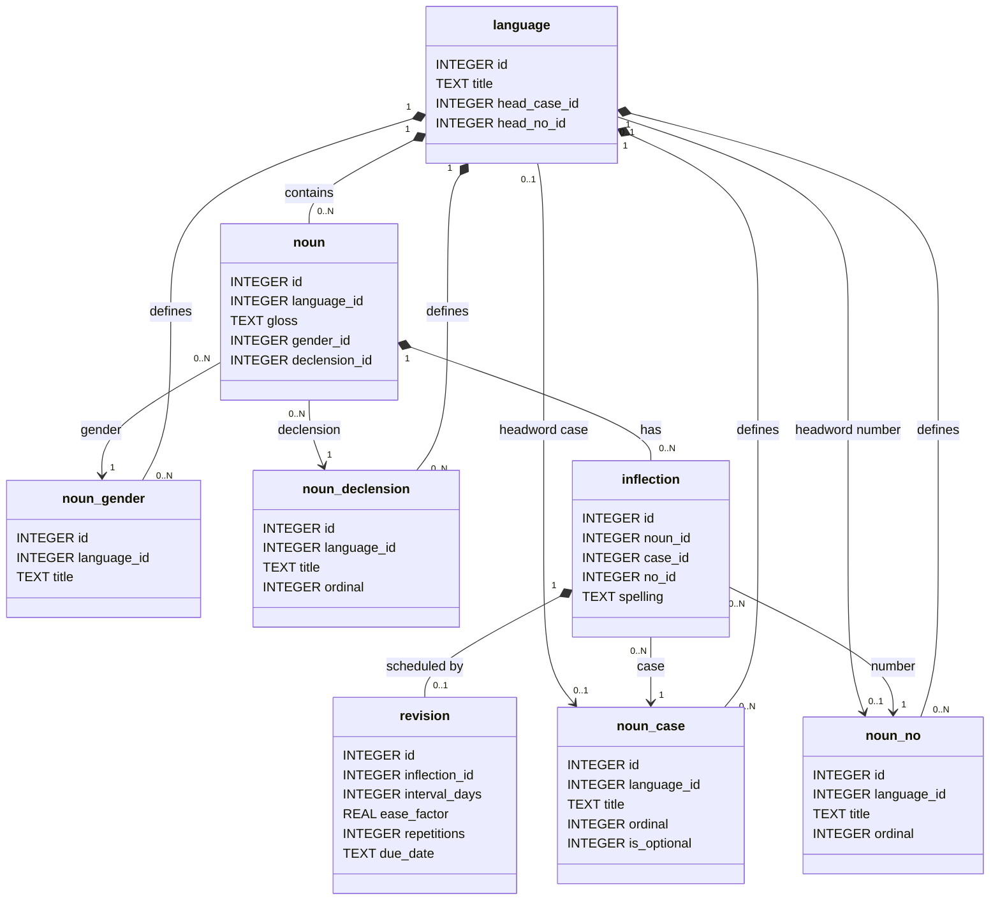

# Declension Trainer

A spaced-repetition application specialised for studying and learning noun inflections in highly-inflected Indo-European languages (e.g. Classical Latin).

- [Usage](#usage)
- [Background](#background)
- [Design](#design)

## Usage

### Prerequisites

- JDK 21+
- Maven 3.9+

### Execution

The scripts below build a self-contained `jar` and start the server:

- UNIX: `run.sh`
- Windows: `run.bat`

To do this manually on any platform:

```
mvn clean package
java -jar target/declension-trainer.jar
```

## Background

In an **inflected** language, the shape of nouns changes depending on the role it plays in a sentence.
There are vestiges of this in English, e.g. _horse_ is singular, but _horses_ is plural.
The _-s_ suffix indicates that the noun is plural.
These changes are called **inflections**.

There are certain key categories in highly-inflected (Indo-European) languages that underpin this process:

- **Case** reflects the role a noun plays in a sentence
- **Number** distinguishes singular and plural nouns
- **Gender** categorises nouns, often into _masculine_, _feminine_, and occasionally also _neuter_

The common cases are:

- **Nominative**: the subject
- **Genitive**: possession, "of"
- **Dative**: the indirect object, "to" or "for"
- **Accusative**: the direct object
- **Ablative**: means, manner, or separation; "by", "with", "from"
- **Vocative**: direct address

A noun's gender and its **declension** (another category) dictate the suffixes it takes for each combination of case and number.
For example, _rex_ in Latin is a masculine, 3rd declension noun, which is inflected as follows:

| Case         | Singular | Plural  |
|--------------|----------|---------|
| _Nominative_ | rēx      | rēgēs   |
| _Genitive_   | rēgis    | rēgum   |
| _Dative_     | rēgī     | rēgibus |
| _Accusative_ | rēgem    | rēgēs   |
| _Ablative_   | rēge     | rēgibus |
| _Vocative_   | rēx      | rēgēs   |

## Design



